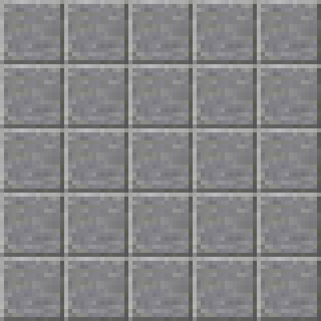
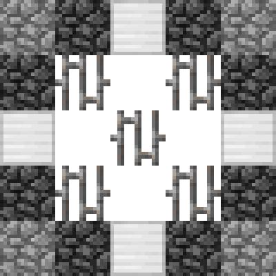
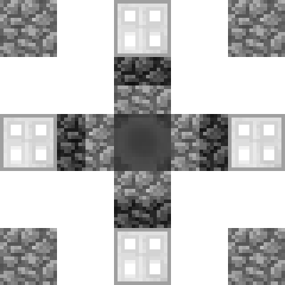
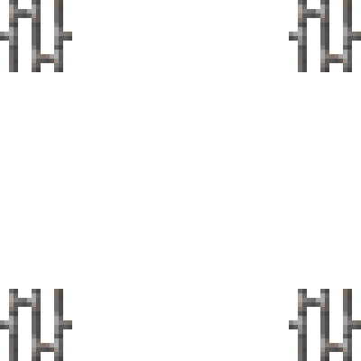
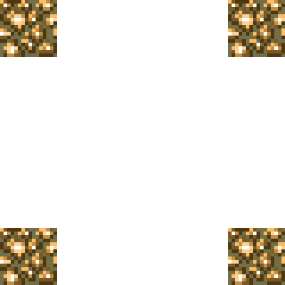

# Overview

An **alchemy** altar transmutes ores into [higher-level](alchemy-ores.md) ores.

# Construction
  
The altar is built as follows:  

(Place the cauldron last.)

(Top down view)  

## Level 1  
  

## Level 2  
(The darker cobble blocks are slabs)      
  

## Level 3  
(The half-dark cobble blocks are stairs)      
  

# Level 4  
  

## Level 5  
  